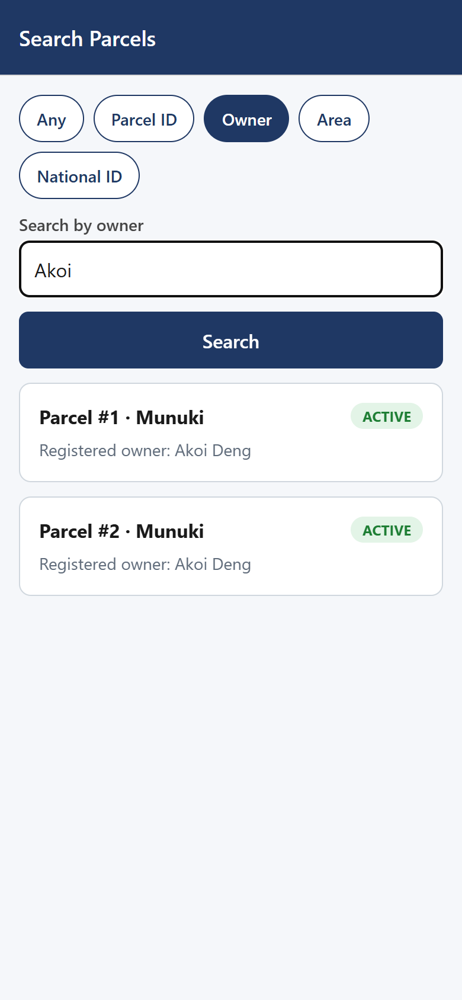

# DLOVS — Digital Land Ownership Verification System

**Initial Software Product / Solution Demonstration**
BSc. Software Engineering Capstone — Monica Akoi Dau Ahol
African Leadership University · Supervisor: Hubert Apana

## Description

DLOVS is a dual-platform system for preventing land grabbing in Juba, South
Sudan, by giving every registered land parcel a tamper-evident QR code that
anyone — including guests with no account — can scan or search to instantly
see who legitimately owns it, its ownership history, and any open disputes.

This repository contains the **initial working implementation** of the
FullStack track deliverable described in the capstone proposal:

| Component | Tech | What it does |
|---|---|---|
| **Backend API** | Node.js / Express + PostgreSQL | Auth, parcel registration, QR generation + signature verification, disputes, audit log |
| **Web App** | React (Vite) | Land Officer / Administrator portal — register parcels, generate QR codes, resolve disputes, view audit log |
| **Mobile App** | React Native (Expo, Expo Router) | Citizen / Guest app — scan QR, verify ownership, flag disputes, view own parcels |

Everything here is built directly from the capstone proposal's own design
artifacts — the ERD (Figure 3), Class Diagram (Figure 4), and the 12-step
Sequence Diagram (Figure 5) — not reinvented. Comments in the code point back
to the specific diagram step or class-diagram method each piece of logic
implements.

## Link to GitHub Repo

`<add the repo URL here once pushed — see "Pushing to GitHub" below>`

## Screenshots

### Web App (Land Officer / Administrator)

| Login | Dashboard |
|---|---|
|  |  |

| Register Parcel + Generate QR | Search / Verify |
|---|---|
|  |  |

### Mobile App (Citizen / Guest)

| Home | Search | Ownership Record |
|---|---|---|
|  |  |  |

The ownership record screen shows the GPS ground-truth check in action:
**"✅ Location confirmed (0.0m from registered GPS)"** — this is the
ten-metre accuracy check from Objective 3 of the proposal, implemented in
`backend/controllers/parcelController.js` (`haversineMeters`).

## How to Set Up the Environment and the Project

### Prerequisites
- Node.js 18+
- PostgreSQL 14+
- Expo Go app on a phone (for the mobile app), or an Android/iOS simulator

### 1. Backend

```bash
cd backend
npm install

# create the database
createdb dlovs_db   # or: psql -c "CREATE DATABASE dlovs_db;"
psql -d dlovs_db -f db/schema.sql

# configure environment
cp .env.example .env   # then edit DATABASE_URL, JWT_SECRET, QR_SIGNING_SECRET

npm start   # or: node index.js
# API runs on http://localhost:4000
```

### 2. Web App

```bash
cd web
npm install
# set VITE_API_URL in .env to point at the backend (default: http://localhost:4000/api)
npm run dev
# open http://localhost:5173
```

Log in as a Land Officer (register one via `POST /api/auth/register` with
`role: "land_officer", platform: "web"`, or use the seed data below).

### 3. Mobile App

```bash
cd mobile
npm install

# Edit src/api/client.js -> API_URL to point at your backend:
#   - Android emulator:      http://10.0.2.2:4000/api
#   - Physical phone (Expo Go): http://<your-computer's-LAN-IP>:4000/api

npx expo start
# scan the QR code with Expo Go, or press 'a' / 'i' for a simulator
```

### Seed data (quick demo setup)

```bash
# Register a Land Officer
curl -X POST http://localhost:4000/api/auth/register -H "Content-Type: application/json" -d \
  '{"full_name":"Officer Deng","phone_number":"+211900000001","password":"pass1234","role":"land_officer","platform":"web"}'

# Register a Citizen
curl -X POST http://localhost:4000/api/auth/register -H "Content-Type: application/json" -d \
  '{"full_name":"Akoi Deng","phone_number":"+211900000002","password":"pass1234","role":"citizen","platform":"mobile"}'
```

Then log into the web app as Officer Deng, register a parcel, and scan its
generated QR code with the mobile app (or search for it) to see the full
verification flow.

## Designs

- **Database schema**: `backend/db/schema.sql` — implements the ERD (Figure 3) exactly: `USER`, `PARCEL`, `OWNER`, `OWNERSHIP_HISTORY`, `DOCUMENT`, `DISPUTE`, `AUDIT_LOG`.
- **API design**: each controller method is named and commented after the matching Class Diagram (Figure 4) method — e.g. `LandOfficer.createParcelRecord(data)`, `Citizen.flagDispute(parcelId)`, `Guest.searchParcel(query)`.
- **UI**: both the web and mobile apps use the same navy (`#1F3864`) brand color as the proposal document's own tables and diagrams, for visual consistency across every artifact in the project.
- Screenshots above serve as the visual mockup/style reference; the actual UI is the live, running implementation rather than a separate Figma file.

## Deployment Plan

Per the proposal's budget (Table 1 — built entirely on free tiers):

| Service | Role | Plan |
|---|---|---|
| **Render.com** | Hosts the Node.js/Express API + PostgreSQL | Free Web Service + free PostgreSQL instance |
| **Netlify** | Hosts the React web app (static build) | Free tier, auto-deploy from GitHub `main` branch |
| **Expo (EAS)** | Distributes the mobile app | Expo Go for development/demo; EAS Build for a shareable `.apk`/TestFlight build post-capstone |
| **Cloudinary** | Document/image storage | Free tier |
| **Africa's Talking** | SMS OTP | Free Sandbox mode |

**Steps to deploy:**
1. Push this repo to GitHub.
2. On Render: create a new Web Service pointed at `/backend`, add the `DATABASE_URL`, `JWT_SECRET`, `QR_SIGNING_SECRET` environment variables, and a managed PostgreSQL instance; run `db/schema.sql` against it once.
3. On Netlify: create a new site pointed at `/web`, build command `npm run build`, publish directory `dist`, and set `VITE_API_URL` to the deployed Render API URL.
4. Update `mobile/src/api/client.js`'s `API_URL` to the deployed Render API URL, then publish with `npx expo publish` or build with `eas build` for a distributable app.

This mirrors the System Architecture Diagram (Figure 1) exactly — no
infrastructure decisions were introduced here that aren't already in the
proposal.

## Video Demo

`<add the video link here — see /docs for a suggested walkthrough script>`

A suggested 5-8 minute walkthrough, focused on functionality (not
re-explaining the research, per the assignment instructions):

1. (30s) One-line context: what DLOVS does and who it's for.
2. (1 min) Web app: log in as Land Officer, register a new parcel, show the generated QR code.
3. (1.5 min) Mobile app: scan that QR code, show the ownership record loading, the GPS "location confirmed" badge, ownership history.
4. (1 min) Mobile app: flag a dispute as a logged-in Citizen.
5. (1 min) Web app: show the dispute appearing in the Officer's Disputes list, resolve it.
5. (1 min) Web app: show the Audit Log recording every action taken.
6. (30s) Briefly show the code structure (backend controllers named after the Class Diagram methods, schema matching the ERD) to demonstrate the requirements-to-code traceability.

## Code Files

```
dlovs/
├── backend/            # Node.js/Express API + PostgreSQL
│   ├── db/schema.sql   # Database schema (matches ERD, Figure 3)
│   ├── controllers/    # Business logic (matches Class Diagram, Figure 4)
│   ├── routes/
│   ├── middleware/     # JWT auth + role-based access control
│   └── utils/qr.js     # QR generation + HMAC signature verification
├── web/                # React web app (Land Officer / Administrator)
│   └── src/
│       ├── pages/
│       ├── components/
│       └── context/
├── mobile/             # React Native / Expo app (Citizen / Guest)
│   └── src/
│       ├── app/        # Expo Router file-based routes
│       ├── context/
│       └── utils/cache.js   # Offline cache fallback (FR16)
└── docs/               # This README's screenshots
```
